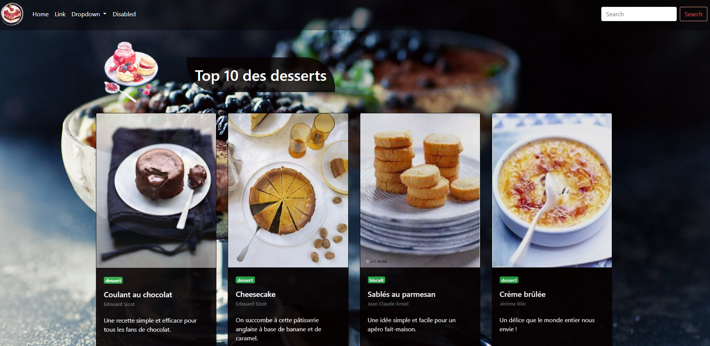

# 10_Collections

* Projet fait par : Jniouen Wassim

* Dans le but d'un exercice pour ma formation   Web "Becode"

---------------------------------------------

## Date du projet 

* Projet commencé le Mardi 10 Novembre 2020 et terminer le vendredi 13 Novembre 2020

---------------------------------------------

## Les consignes

[ => lien des consignes](https://github.com/becodeorg/bxl-hopper-1-25/tree/master/The%20Field/5.leaving_the_field)

---------------------------------------------

## Languages utilisés + objectif

* Js

* HTML5

* CSS3

### Apprendre à lié du Js avec l'HTML le CSS en utilisant un framework ( dans mon cas j'utilise 'Bootstrap' )

---------------------------------------------

## Mon projet

[ => lien de mon projet ](https://jniouen-wassim.github.io/10_Collections/)

---------------------------------------------

## Screenshots de mon projets :

